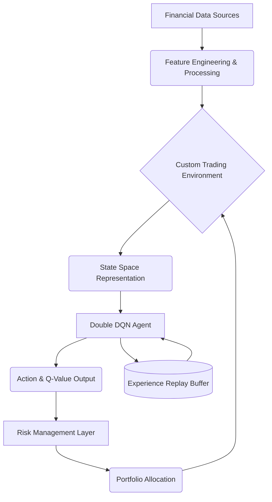

# 🤖 Autonomous Deep Reinforcement Learning Trading System (ADRLTS)


> **Disclaimer:** This repository serves as a **public architectural overview and portfolio demonstration**. The source code logic in `.py` files has been intentionally obfuscated (or omitted) to protect proprietary intellectual property.

## 🔬 Overview

**ADRLTS** is a sophisticated, highly scalable Python-based platform designed for autonomous algorithmic trading. It streamlines the complex process of quantitative strategy formulation by evaluating non-stationary financial time-series data using **Deep Reinforcement Learning (DRL)**. 

The platform orchestrates everything from robust financial data ingestion and feature engineering to complex model training (Double DQN) and backtesting, acting as an autonomous hedge fund analyst capable of executing strictly risk-managed trades.

## ✨ Key Features

*   **📈 Automated Data Processing:** Seamless transformation of raw historical market data into normalized, stationary state-space vectors.
*   **🛡️ Robust Risk Management:** Built-in dynamic position sizing and hard drawdown limits to ensure algorithmic decisions respect strict market constraints.
*   **🧠 Deep Reinforcement Learning:** Utilizes a highly stable Double Deep Q-Network (Double DQN) to prevent catastrophic overfitting to historical bull markets.
*   **🔄 Custom Trading Environment:** A proprietary OpenAI Gym-style environment simulating real-world mechanics like transaction costs, order slippage, and liquidity.
*   **🧪 Algorithmic Validation:** Walk-forward validation and paper trading infrastructure designed to prove out-of-sample expected value before live deployment.

## 🏗️ System Architecture



## 📁 Project Structure

The project is structured following enterprise-level software engineering principles to ensure modularity, scalability, and maintainability.

```text
ADRLTS Root
├── agents/                 # Reinforcement Learning logic
│   ├── dqn_agent.py        # Double DQN implementation
│   └── __init__.py         # Initialization module
├── data/                   # Financial time-series data storage
│   ├── download.py
│   └── preprocess.py
├── env/                    # Reinforcement Learning environments
│   ├── trading_env.py
│   └── __init__.py
├── experiments/            # Hyperparameter configs and training results
├── features/               # Technical indicator and scaler pipelines
│   ├── indicators.py
│   └── __init__.py
├── portfolio/              # Trade simulation and tracking logic
│   ├── portfolio_runner.py
│   └── __init__.py
├── risk/                   # Dynamic position sizing & drawdown limits
│   ├── capital_guard.py
│   └── __init__.py
├── training/               # Training loop and episodic validation
│   ├── evaluate_dqn_many.py
│   ├── evaluate_portfolio.py
│   ├── train_dqn_many.py
│   └── __init__.py
├── paper_trade.py          # Trade Execution API
├── paper_trade_daily.py    # Daily interval validation
├── paper_trade_walk.py     # Continuous walk-forward validation
└── validate_data.py        # Data Integrity Validation
```

## 🛠️ Technology Stack

| Domain | Technologies Used |
| :--- | :--- |
| **Language** | Python 3.11+ |
| **Deep Learning** | PyTorch (`torch`, `torch.nn`) |
| **Data Processing** | NumPy, Pandas |
| **Algorithm** | Reinforcement Learning (Double DQN) |
| **Environment** | Custom-Built Reinforcement Learning Trading Environment |
| **Execution** | Windows PowerShell / Terminal Automation |

## 🚀 Usage (Architectural Concept)

The platform is designed to autonomously adapt to shifting market conditions. A typical workflow involves:
1.  **Ingestion:** Running feature pipelines to construct environment states.
2.  **Training:** Executing `-train` scripts via the `Double DQN` agent using Experience Replay.
3.  **Validation:** Running `paper_trade_walk.py` to evaluate model endurance and Risk-Adjusted Returns (Sharpe/Sortino proxies).

---
*Architected and Engineered by [Shaurya Dobhal](https://github.com/shauryadobhal)*
